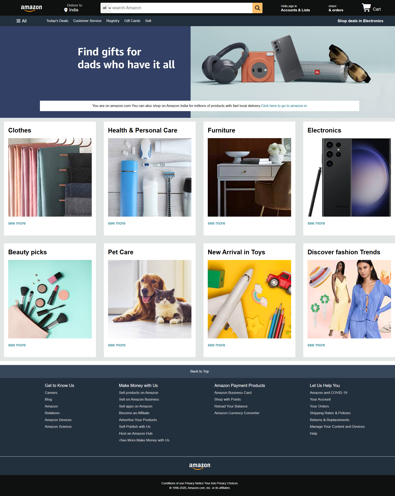

# Amazon Clone

A responsive frontend clone of the Amazon homepage built using HTML5 and CSS3. This project focuses on recreating the layout and user interface of Amazon's landing page while applying modern web development practices such as Flexbox, responsive design, and structured styling.

## Preview

## Key Features

* Amazon-inspired navigation bar
* Search interface
* Hero section with promotional banner
* Product category cards
* Multi-section content layout
* Footer with navigation links
* Responsive design for different screen sizes

## Tech Stack

| Technology | Purpose                           |
| ---------- | --------------------------------- |
| HTML5      | Structure and content             |
| CSS3       | Styling and layout                |
| Git        | Version control                   |
| GitHub     | Project hosting and collaboration |

## Project Structure

amazon-clone/
│
├── index.html
├── style.css
├── images/
├─ homepage.png
└── README.md

## Learning Objectives

This project was developed to strengthen practical skills in:

* Semantic HTML
* CSS Flexbox
* Responsive Web Design
* UI Replication
* Git & GitHub Workflow

## Getting Started

To run this project locally:

1. Clone the repository

git clone https://github.com/PriyankaYadav131017/amazon-clone.git

2. Navigate to the project directory

cd amazon-clone

3. Open `index.html` in your preferred web browser.

## Author

**Priyanka Yadav**
B.Tech Student
NIT Manipur

GitHub: https://github.com/PriyankaYadav131017

